# 🧩 온라인 배틀 퍼즐 게임 Puzzle-Pop!

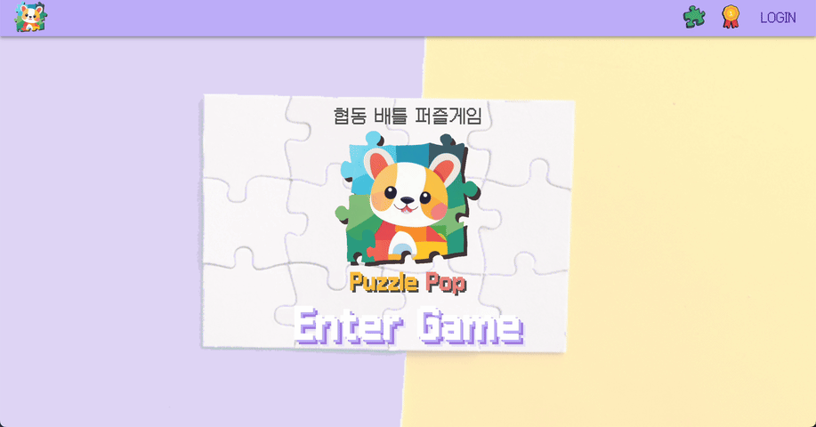

# Overview

정적이고 맞추기만 하는 퍼즐 게임은 이제 그만!

온라인으로 아이템을 사용하며 상대방과 배틀 퍼즐을 시작하세요!

# Puzzle-Pop 서비스 화면

### 인게임

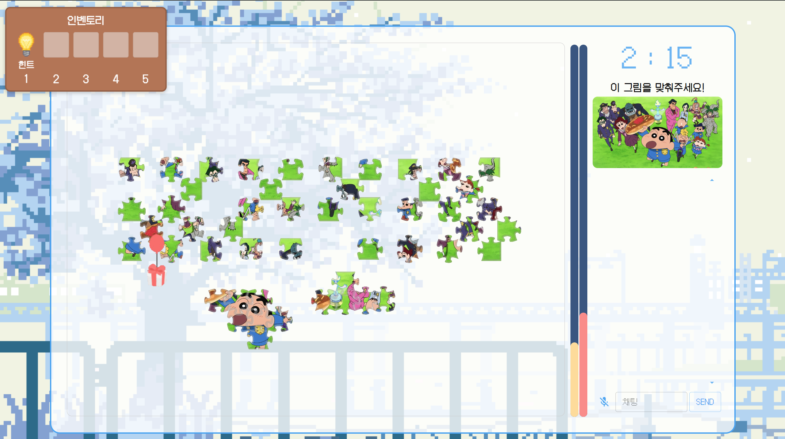

### 게임 리스트

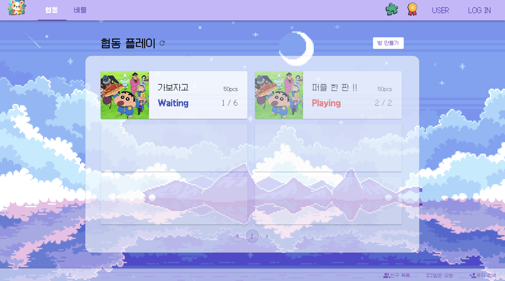

### 대기실

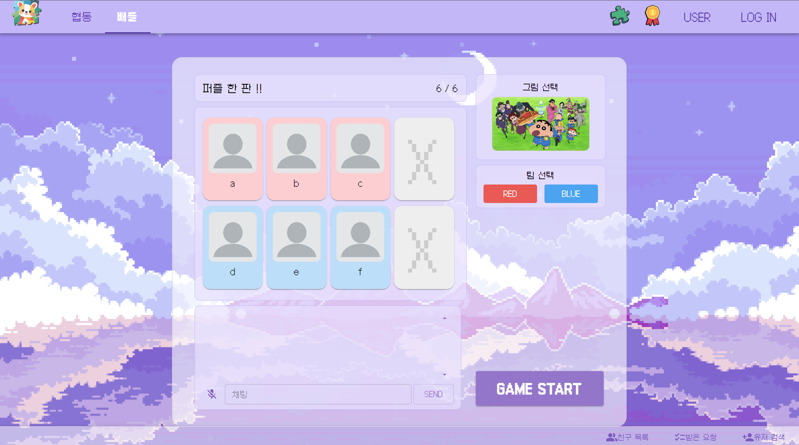

### 아이템


### 친구

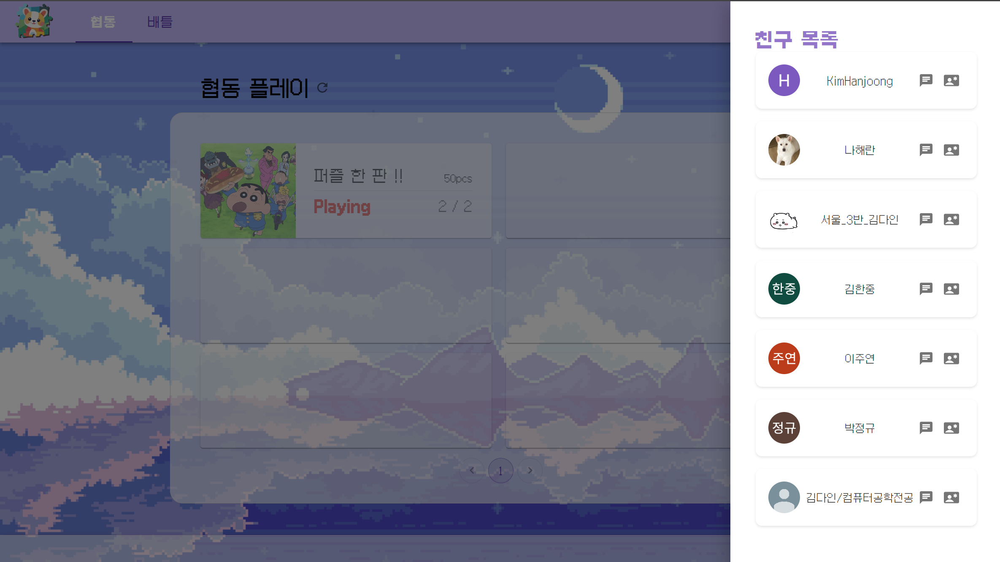

### 랭킹

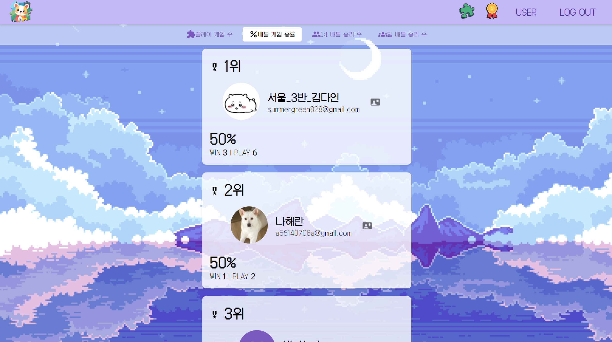

# 주요 기능

### 서비스 소개

온라인으로 공격/버프/방어 아이템을 사용하여 퍼즐을 맞추고,
상대방과 대결까지 할 수 있는 서비스

### 프로젝트 기능

- 협동 퍼즐 게임 서비스
  - WebRTC, WebSocket과 퍼즐을 결합하여 팀원과 퍼즐판을 공유하고 소통하며 오프라인처럼 즐길 수 있다.
  - 버프 아이템 효과, 콤보 효과를 구현하였다.
- 배틀 퍼즐 게임 서비스
  - WebRTC, WebSocket과 퍼즐을 결합하여 팀원과 퍼즐판을 공유하고 소통하며 오프라인처럼 즐길 수 있다.
  - 공격/버프/방어 아이템 효과, 콤보 효과 등 보다 더 다이나믹한 효과를 구현하였다.
  - 상대팀의 퍼즐 진행률을 실시간으로 확인하고 아이템으로 상대방을 공격 또는 상대방의 공격을 방어할 수 있다.
- 빠른 시작 기능
  - 랜덤으로 배틀 1대1 게임을 매칭해준다.
- 친구 관련 기능
  - 친구와 채팅을 할 수 있다.
  - 유저를 검색하고 친구 추가를 할 수 있다.
- 랭킹
  - 게임 타입 별 승률, 승리 횟수 등 다양한 랭킹 조회 시스템을 지원한다.

### 개발환경

- OS
  - Local : Windows 10
  - AWS : Ubuntu 20.04.4 LTS
- IDE
  - IntelliJ IDE 2023.3.2
  - Visual Studio Code 1.70.0
- UI / UX
  - Figma
- DataBase
  - MySQL workbench 8.0.20 (Windows 10)
  - MySQL 8.0.30 (Ubuntu 20.04.2 LTS)
- CI/CD
  - Jenkins

### 상세 스택

- Backend
  - JAVA - Zulu 17
  - Gradle 8.5
  - SpringBoot 3.2.1, JPA, Lombok 1.18.20
  - security, oauth-client2, jjwt 0.11.5
  - JUnit5
  - Stomp 2.3.4
- FrontEnd
  - HTML5, CSS3, JavaScript(ES6)
  - React 18.2.0, paper.js 0.12.17, Material-UI, recoil 0.7.7
  - Node.js 16.16, Vite 5.0.8
  - @stomp/stompjs 7.0.0
- Web RTC
  - openvidu-browser 2.29.0

### 협업 툴

- 이슈 관리 : Jira
- 형상 관리 : Gitlab, Git
- 커뮤니케이션 : Notion, MatterMost, Discord

### 서비스 아키텍처

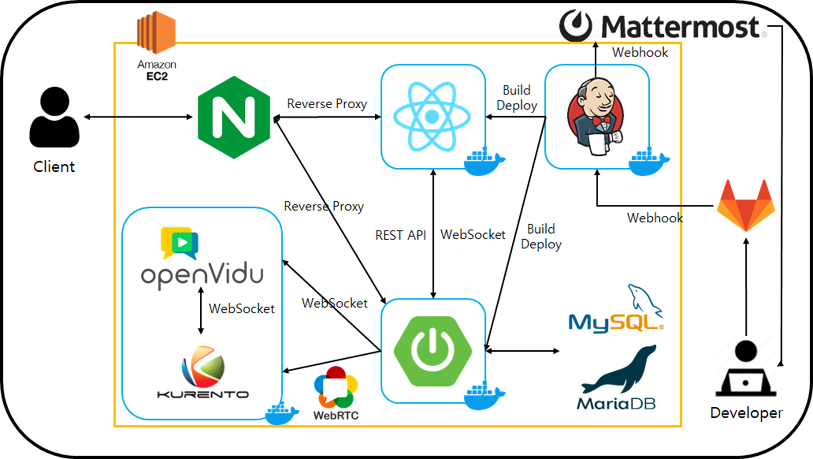

### WBS

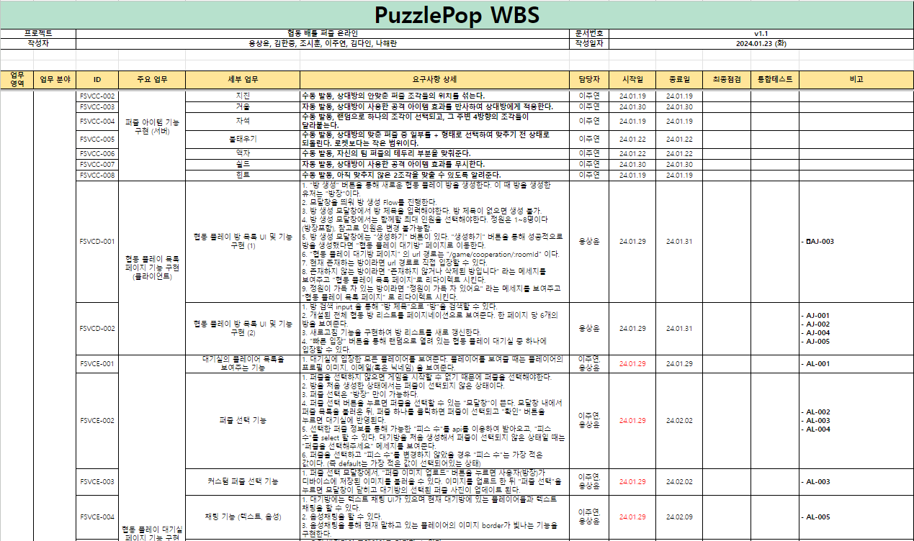

### API 명세서

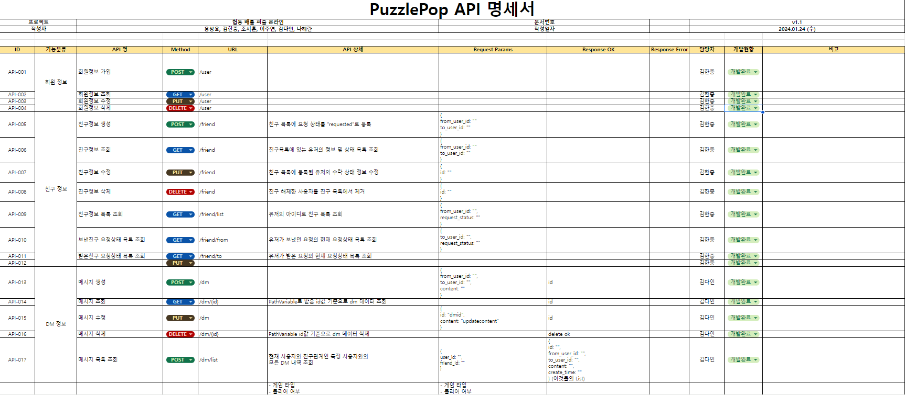

### 화면 설계서

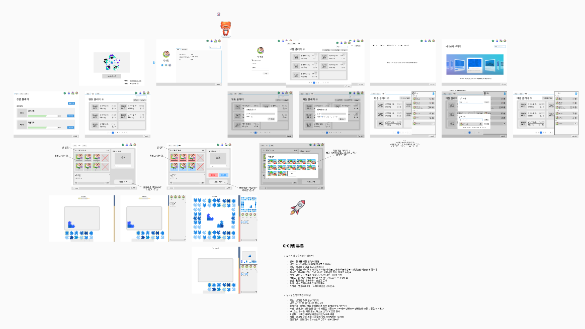

### Git Commit 컨벤션

- `feat` : 새로운 기능 추가
- `fix` : 버그 수정
- `docs` : 문서 내용 변경
- `style` : 포맷팅, 세미콜론 누락, 코드 변경이 없는 경우 등
- `refactor` : 코드 리팩토링
- `test` : 테스트 코드 작성
- `chore` : 빌드 수정, 패키지 매니저 설정, 운영 코드 변경이 없는 경우 등

```
type: subject

ex) 회원가입 기능

- feat: Join in
```

### Git Branch 전략

`git-flow`전략

- `master`
- `develop`
- `feature/fe/function1`
- `feature/be/function2`

### Jira

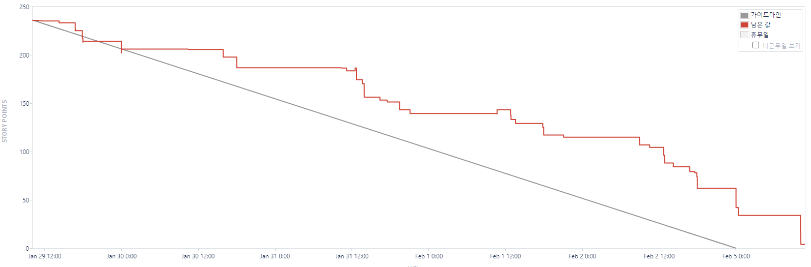

### ERD


### EC2 포트 정리

| Port |                      |
| ---- | -------------------- |
| 8081 | openvidu server      |
| 8888 | Kurrento server      |
| 80   | nginx HTTP 기본 포트 |
| 443  | nginx HTTPS          |
| 3306 | mysql                |
| 3001 | react app            |
| 8080 | Spring boot          |

### 팀원 역할

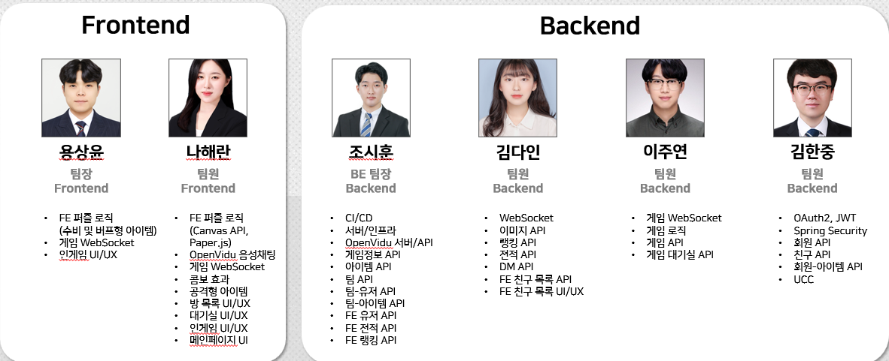
